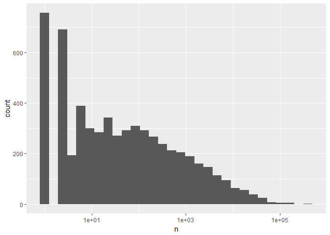
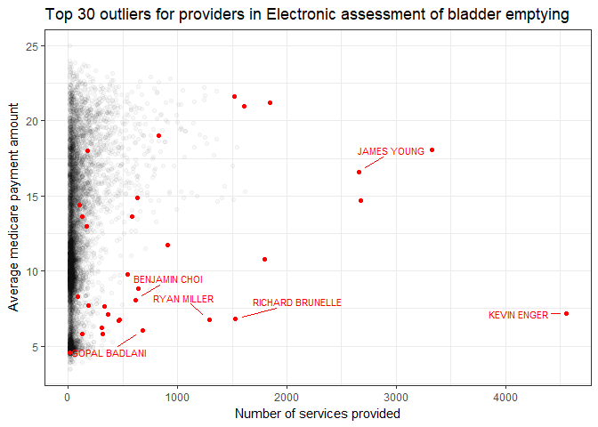
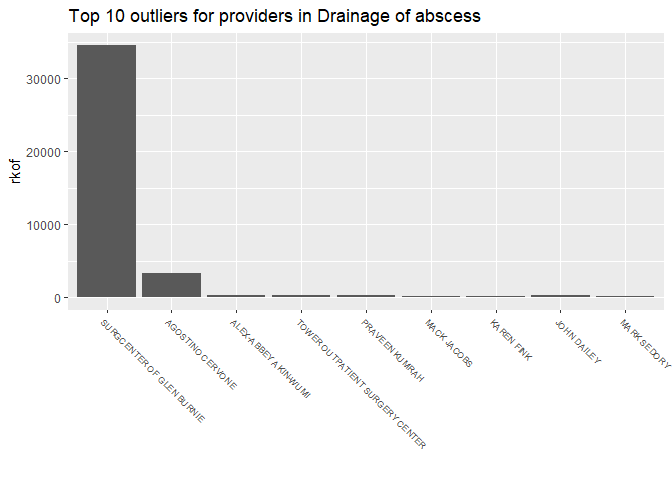
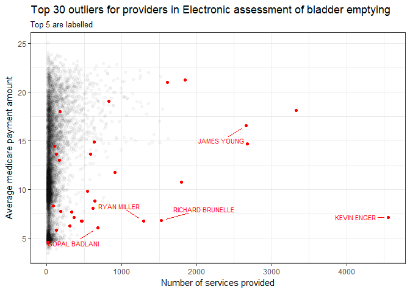

Medicare Anomaly Detection
================
Chris Oh
2017-11-07

-   [Motivation](#motivation)
-   [Data](#data)
    -   [Source](#source)
    -   [Data parsing](#data-parsing)
    -   [Checking for data quality](#checking-for-data-quality)
-   [Local Density-Based Outlier Detection](#local-density-based-outlier-detection)
    -   [Data prepartion](#data-prepartion)
    -   [Outlier score computation](#outlier-score-computation)
    -   [Visualizing the results](#visualizing-the-results)
        -   [Visualization by different scores (highest to lowest)](#visualization-by-different-scores-highest-to-lowest)
        -   [By the two most relevant variables](#by-the-two-most-relevant-variables)
-   [Possible Application](#possible-application)
-   [Challenges / Ideas](#challenges-ideas)
    -   [Model parameters](#model-parameters)
    -   [Defining outliers](#defining-outliers)

``` r
# Libraries
library(tidyverse)
library(ldbod)
library(knitr)
library(ggrepel)
```

Motivation
----------

As a part of a series called *Medicare Unmasked*, which won Pulitzer Prize for Investigative Reportings, the journalists at Wall Stree Journal (WSJ) explored unusual doctor billings [*Taxpayers Face Big Tab For Unusual Doctor Billings*](http://www.pulitzer.org/files/2015/investigative-reporting/wsjmedicare/01wsjmedicare2015.pdf), 2014 Jun 10.

As a part of a project for Stanford's Data Challenge Lab, I previously explored unusual billings by picking out key variables and creating new ones from which subsetting criteria were created manually.

The goal of this project is to use unsuprvised anomaly detection algorithms to:

-   Expedite the process without relying on arbitrary thresholds.
-   Better detect higher-dimensional outliers (2D and above).
-   Establishing a standard that is highly scalable.

Data
----

### Source

The billing data is publicly available from the US government agency that oversees Medicare.

-   [Physician and Other Supplier Data CY 2012](https://www.cms.gov/Research-Statistics-Data-and-Systems/Statistics-Trends-and-Reports/Medicare-Provider-Charge-Data/Physician-and-Other-Supplier2012.html).

[This document](https://www.cms.gov/Research-Statistics-Data-and-Systems/Statistics-Trends-and-Reports/Medicare-Provider-Charge-Data/Downloads/Medicare-Physician-and-Other-Supplier-PUF-Methodology.pdf) provides detailed explanations of the dataset, with Section 5 containing descriptions about the variables.

### Data parsing

The raw detailed data is available in a .txt format and contains more than 9 million observations.

To convert the raw data into a workable .rds format, an R script was run separately.

The processed file is read in as `medicare`.

``` r
medicare <- read_rds(file_detailed_rds)
```

### Checking for data quality

This part of the section is masked from public viewing for confidentiality purpose.

Below are some of the steps taken:

-   Check for NA's and investigate the reasons for the missing values.
-   Check for duplicates.
-   Check for distribution of variables (credentials, provider types).

Local Density-Based Outlier Detection
-------------------------------------

Local density-based outlier detection (`ldbod`) uses the k-nearest-neighbor approach to computing the outlier scores for given observations.

The `ldbod` package allows the user to accomodate for different sizes of `k` as well as different density-based methods (by default, all 4 available methods -- LOF, LDF, RKOF, LPDF -- are used).

It also allows for a random subsampling of the input data, which in this case, was deemed unneccesary given the size of each `HCPCS_CODE` (procedure / medication) group as we will see in a later section.

### Data prepartion

We have to subset the data by numeric variables and those without any missing values to run the detection algorithm.

Among these, I pick out the relevant variables over which outlier scores should be computed.

``` r
medicare_num <-
  medicare %>% 
  select(
    NPI,
    HCPCS_CODE,
    ends_with("_CNT"),
    AVERAGE_SUBMITTED_CHRG_AMT,
    AVERAGE_MEDICARE_PAYMENT_AMT
  )

medicare_num %>%
  head(2) %>% 
  knitr::kable()
```

| NPI        | HCPCS\_CODE |  LINE\_SRVC\_CNT|  BENE\_UNIQUE\_CNT|  BENE\_DAY\_SRVC\_CNT|  AVERAGE\_SUBMITTED\_CHRG\_AMT|  AVERAGE\_MEDICARE\_PAYMENT\_AMT|
|:-----------|:------------|----------------:|------------------:|---------------------:|------------------------------:|--------------------------------:|
| 1003000126 | 99222       |              115|                112|                   115|                            199|                         108.1157|
| 1003000126 | 99223       |               93|                 88|                    93|                            291|                         158.8700|

Now, we need a nested dataset of `medicare_num` by `HCPCS_CODE` so that we can run the outlier score calculation algorithm within each `HCPCS_CODE`.

Before doing so, let us look at the distribution of the number of data points in each `HCPCS_CODE`.

``` r
medicare_num %>%
  count(HCPCS_CODE) %>%
  ggplot(aes(n)) +
  geom_histogram() +
  scale_x_log10()
```

    ## `stat_bin()` using `bins = 30`. Pick better value with `binwidth`.



Many products / services have less than 100 instances in the dataset.

These in themselves are outliers and would certainly warrant a closer inspection.

However, they are deemed unfit for the type of outier detection we are after here, so they are subsetted out.

``` r
medicare_num %>% 
  group_by(HCPCS_CODE) %>%
  filter(n() > 100) %>% 
  head() %>%
  knitr::kable()
```

| NPI        | HCPCS\_CODE |  LINE\_SRVC\_CNT|  BENE\_UNIQUE\_CNT|  BENE\_DAY\_SRVC\_CNT|  AVERAGE\_SUBMITTED\_CHRG\_AMT|  AVERAGE\_MEDICARE\_PAYMENT\_AMT|
|:-----------|:------------|----------------:|------------------:|---------------------:|------------------------------:|--------------------------------:|
| 1003000126 | 99222       |              115|                112|                   115|                            199|                        108.11565|
| 1003000126 | 99223       |               93|                 88|                    93|                            291|                        158.87000|
| 1003000126 | 99231       |              111|                 83|                   111|                             58|                         30.72072|
| 1003000126 | 99232       |              544|                295|                   544|                            105|                         56.65566|
| 1003000126 | 99233       |               75|                 55|                    75|                            150|                         81.39000|
| 1003000126 | 99238       |               95|                 95|                    95|                            104|                         55.76884|

Now, we can proceed to nest the dataset by `HCPCS_CODE`.

\*Note: Below is a sample workflow that could be eventually applied to the entire dataset. Due to a large memeory requirement, the full job cannot be run on a local machine. This issue can be overcome by submitting a batch request to SLURM (through Stanford, in my case, where a script can be run on a machine with much higher memory capacity). To apply the algorithm to the entire dataset, one can simply take out the `filter` line.

Below, I randomly picked two different `HCPCS_CODE`s to illustrate how the outlier scores could be applied to each nested dataset.

``` r
medi_test <-
  medicare_num %>% 
  filter(HCPCS_CODE %in% c("10060", "51741")) %>% 
  group_by(HCPCS_CODE) %>% 
  nest()
```

### Outlier score computation

Score calculation steps:

-   Apply `ldbod` to the nested dataset for each `HCPCS_CODE`.
-   The `k` parameter passed to `ldbod` should be adjusted based on the number of datapoints in each of these nested datasets.
-   `NPI` should not be passed on to the `ldbod`.
-   All 4 available methods (LOF, LDF, RKOF, and LPDF) are used to comput the outlier scores (default).
-   The a total of 9 different scores are computed and added to each original nested dataset.

``` r
apply_ldbod <- function(df) {
  # exclude NPI
  data <- df %>% select(-NPI)
  # controls the size of k depending on the number of observations
  neighbor <-
    ifelse(nrow(df) < 1000, .1 * nrow(df), 100)
  
  # outlier score calculation
  scores <- ldbod(data, k = neighbor)
  
  # attach the comuted scores
  df <-
    df %>% 
    cbind(map_df(scores, as.numeric))
}

medi_test <-
  medi_test %>% 
  mutate(data = map(data, apply_ldbod))
```

### Visualizing the results

Now that we have computed the 9 different outlier scores within each `HCPCS_CODE` group, let's visualize some of the results.

``` r
# Get all the variables in the original dataset
# Note that each row is distinct for each practitioner (NPI) and
# procedure (HCPCS_CODE)
medi_test <-
  medi_test %>% 
  unnest() %>% 
  select(-ends_with("CNT"), -ends_with("AMT")) %>% 
  left_join(medicare, by = c("NPI", "HCPCS_CODE"))
```

#### Visualization by different scores (highest to lowest)

``` r
# Labelling for top outliers
label_outlier <- function(f_name, l_o_name) {
  # If an NPI belongs to an organization, the organization name will be returned.
  # If an NPI belongs to an individual, the full name will be returned.
  ifelse(is.na(f_name), l_o_name, str_c(f_name, " ", l_o_name))
}

# Get the top entries based on a given metric for a particular
# subset of a dataset
get_top_n <- function(df, filter_var, which, number, wght) {
  filter_var <- enquo(filter_var)
  wght <- enquo(wght)
  df %>% 
    filter(UQ(filter_var) %in% which) %>%
    top_n(n = number, wt = !! wght)
}
```

``` r
medi_test %>% 
  get_top_n(HCPCS_CODE, "51741", -10, lpde) %>%
  mutate(org_name = label_outlier(NPPES_PROVIDER_FIRST_NAME, NPPES_PROVIDER_LAST_ORG_NAME)) %>% 
  ggplot(aes(fct_reorder(org_name, lpde), lpde)) +
  geom_col() +
  labs(
    title = str_c("Top 10 outliers for providers in ", 
                  medi_test %>% 
                  filter(HCPCS_CODE %in% "51741") %>%
                  pull(HCPCS_DESCRIPTION) %>% 
                  unique()
            ),
    x = ""
  ) +
  theme(axis.text.x = element_text(angle = -45, hjust = 0, size = 7))
```



``` r
medi_test %>% 
  get_top_n(HCPCS_CODE, "10060", 10, rkof) %>%
  mutate(org_name = label_outlier(NPPES_PROVIDER_FIRST_NAME, NPPES_PROVIDER_LAST_ORG_NAME)) %>% 
  ggplot(aes(fct_reorder(org_name, -rkof), rkof)) +
  geom_col() +
  labs(
    title = str_c("Top 10 outliers for providers in ", 
                  medi_test %>% 
                  filter(HCPCS_CODE %in% "10060") %>%
                  pull(HCPCS_DESCRIPTION) %>% 
                  unique()
            ),
    x = ""
  ) +
  theme(axis.text.x = element_text(angle = -45, hjust = 0, size = 7))
```



#### By the two most relevant variables

-   `LINE_SRVC_CNT` - for practitioners with excessively high number of treatments
-   `AVERAGE_SUBMITTED_CHRG_AMT` - for practioners who might be over-billing for the treatment category compared to others

Therefore, these two variables were chosen for the visualization although the actual scores computed take into account all 5 variables ().

The plots below show the top 30 outliers, 5 of which are labelled, as indicated by:

-   local parametric density estimate (LPDE) - for `HCPCS_CODE` 51741
-   robust kernel density factor (RKOF) - for `HCPCS_CODE` 10060

As can be seen, the algorithms seemed to have done a fairly good job of identifying the outliers.

``` r
medi_test %>% 
  filter(HCPCS_CODE %in% "51741") %>% 
  ggplot(aes(LINE_SRVC_CNT, AVERAGE_MEDICARE_PAYMENT_AMT)) +
  geom_point(alpha = .03) +
  geom_point(
    color = "red",
    data = medi_test %>% get_top_n(HCPCS_CODE, "51741", -30, lpde)
  ) +
  ggrepel::geom_text_repel(
    aes(
      label = 
        label_outlier(NPPES_PROVIDER_FIRST_NAME, NPPES_PROVIDER_LAST_ORG_NAME)
    ),
    color = "red",
    size = 3,
    point.padding = .8,
    segment.size = .3,
    data = medi_test %>% get_top_n(HCPCS_CODE, "51741", -5, lpde)
  ) +
  labs(
    title =
      str_c("Top 30 outliers for providers in ", 
             medi_test %>% 
              filter(HCPCS_CODE %in% "51741") %>%
              pull(HCPCS_DESCRIPTION) %>% 
              unique()
            ),
    subtitle = "Top 5 are labelled",
    x = "Number of services provided",
    y = "Average medicare payment amount"
  ) +
  theme_bw()
```



``` r
medi_test %>% 
  filter(HCPCS_CODE %in% "10060") %>% 
  ggplot(aes(LINE_SRVC_CNT, AVERAGE_MEDICARE_PAYMENT_AMT)) +
  geom_point(alpha = .03) +
  geom_point(
    color = "red",
    data = medi_test %>% get_top_n(HCPCS_CODE, "10060", 30, rkof)
  ) +
  ggrepel::geom_text_repel(
    aes(
      label = 
        label_outlier(NPPES_PROVIDER_FIRST_NAME, NPPES_PROVIDER_LAST_ORG_NAME)
    ),
    color = "red",
    size = 3,
    point.padding = .8,
    segment.size = .3,
    data = medi_test %>% get_top_n(HCPCS_CODE, "10060", 5, rkof)
  ) +
  labs(
    title =
      str_c("Top 30 outliers for providers in ", 
             medi_test %>% 
              filter(HCPCS_CODE %in% "10060") %>%
              pull(HCPCS_DESCRIPTION) %>% 
              unique()
            ),
    subtitle = "Top 5 are labelled",
    x = "Number of services provided",
    y = "Average medicare payment amount"
  ) +
  theme_bw()
```


Possible Application
--------------------

Based on the results from above, we can pick out the outlier within each procedure / treatment / medication for closer inspection or monitoring.

Similarly, we can also build a classifier with the exisitng body of data when a new stream of billing records come in.

This can be achieved by computing the outlier scores based on the existing data then applying them on the new data points. `ldbod.ref` function can be employed for this purpose.

Challenges / Ideas
------------------

### Model parameters

Choosing the right `k` (for the neighborhood size) is tricky since `k` should be large enough to lower the error rate while small enough to only include the "true" neighboring data points.

In this respect, the robust kenrel-based local outlier detection method (RKOF) seems to be the most suitable, as it is much less senstive to the size of `k`. More details of the algorithm can be found in [this paper](http://www.nlpr.ia.ac.cn/2011papers/gjhy/gh116.pdf).

However, there is not a hard evidence from the dataset to decide which metric is clearly superior.

### Defining outliers

As evidenced by the plots from above, the outlier detection mechanism does not discriminate between unusally low values or unusually high vaues.

For the purpose of fraud / abuse detection in the billings record, it might be appropriate to only look at instances where the values are unconventionally high.

However, a record that is very low in terms of one variable might be very high in another.

In this sense, it may be appropriate to filter out only the observations that have low numbers across all values before computing the outlier scores.

For example, in this dataset, there is a varaible that denotes the average amount for each `HCPCS_CODE`, which could serve as a threshold for this purpose.
